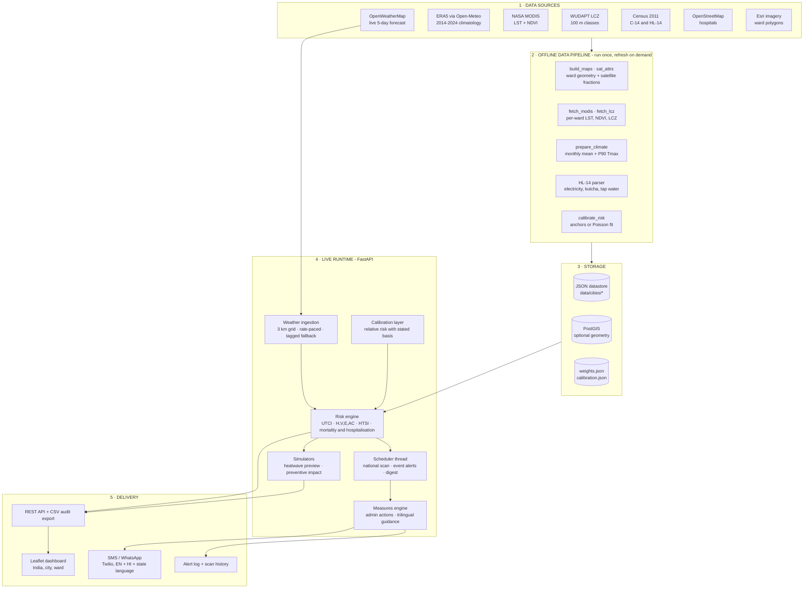
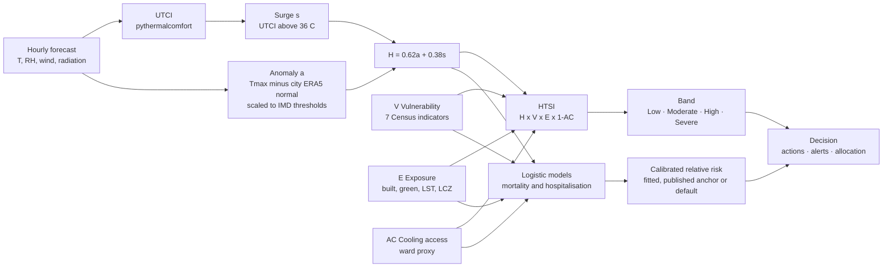
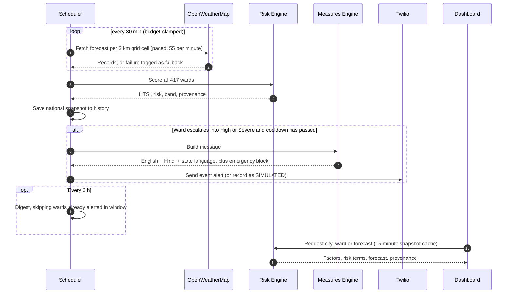

<div align="center">

# TAPAS
### Thermal Assessment & Protection Analytics System

**A ward-level extreme-heatwave early warning system with a Human Thermal Stress Index, for Indian cities**

[](https://sih.gov.in)
[](https://tapas-1-8mey.onrender.com)


</div>

<p align="center"><b>Problem Statement ID: 26083</b> &nbsp;|&nbsp; <b>Team Name: Ecolytes</b></p>

---

## Smart India Hackathon 2026

| Field | Details |
|---|---|
| **Problem Statement ID** | **26083** (SIH26083) |
| **Problem Statement Title** | Extreme Heatwave Early Warning and Human Thermal Stress Index |
| **Organization** | Ministry of Earth Sciences |
| **Theme** | Disaster Management |
| **Category** | Software |
| **Team Name** | **Ecolytes** |

- 🌐 **Live Demo:** <https://tapas-1-8mey.onrender.com>
- 🎥 **Demo Video:** <https://youtu.be/VvamWQAeTxo>

---

## Table of Contents

1. [Problem Statement](#1-problem-statement)
2. [Our Solution](#2-our-solution)
3. [Key Features](#3-key-features)
4. [How It Works](#4-how-it-works)
5. [System Architecture](#5-system-architecture)
6. [Tech Stack](#6-tech-stack)
7. [Data Sources](#7-data-sources)
8. [Pilot Coverage](#8-pilot-coverage)
9. [Screenshots](#9-screenshots)
10. [Getting Started](#10-getting-started)
11. [Project Structure](#11-project-structure)
12. [Transparency & Limitations](#12-transparency--limitations)
13. [Future Scope](#13-future-scope)
14. [Acknowledgements](#15-acknowledgements)

---

## 1. Problem Statement

Heatwaves are among India's deadliest and fastest-growing climate hazards. Current warnings are typically issued at **district or city level** and are driven by **temperature alone**, which creates three gaps:

- **Not local enough.** Within one city, a dense, low-vegetation ward with poor cooling access faces far higher risk than a leafy neighbourhood, yet both receive the same alert.
- **Temperature isn't the whole story.** Humidity, wind and radiation determine how heat is actually *felt* by the human body. A humid coastal city can hit high afternoon temperatures every day without being in a heatwave.
- **Warnings don't reach people in a usable form.** Alerts are rarely tied to concrete actions, and rarely delivered in the languages residents speak.

**PS 26083** calls for an extreme-heatwave early-warning capability built around a **Human Thermal Stress Index**.

---

## 2. Our Solution

**TAPAS** scores heat risk **per municipal ward** by combining a live weather forecast with the ward's own urban form, social vulnerability and cooling access, and turns that score into action.

1. **Measures human thermal stress** using the Universal Thermal Climate Index (UTCI), not just air temperature.
2. **Detects heatwaves the way IMD defines them**, as a departure from *that city's own* observed seasonal normal, so alerts fire on genuine anomalies rather than routinely hot, humid weather.
3. **Scores every ward** with a transparent composite, the **Heat–Health Stress Index (HTSI)**, from Hazard, Vulnerability, Exposure and Adaptive Capacity.
4. **Estimates mortality and hospitalisation risk**, with mortality tied to published epidemiological relative risks.
5. **Recommends Heat Action Plan measures** for authorities and residents, and shows the modelled effect of applying them.
6. **Alerts people automatically** by SMS/WhatsApp in **English, Hindi and their state language**, with a heat-stroke emergency block at High and Severe.

---

## 3. Key Features

| | Feature | What it gives you |
|---|---|---|
| 🌡️ | **Human Thermal Stress Index (UTCI + HTSI)** | Risk that reflects how heat is felt by people, not just the thermometer |
| 🗺️ | **Ward-level GIS dashboard** | India → city → ward drill-down, with layers for Risk, Mortality, Hospitalisation Spike, UTCI and Vegetation |
| ⏱️ | **5-day ward forecast** | Daily peak HTSI, UTCI and risk bands, with forecast confidence that decays with lead time |
| 🚨 | **Automated event alerts + city digest** | Deduplicated threshold-crossing alerts and a 6-hourly digest with cross-suppression, so authorities aren't spammed |
| 🗣️ | **Trilingual guidance** | English + Hindi + Marathi / Gujarati / Tamil / Telugu, with emergency numbers 112 / 108 |
| 🛠️ | **Preventive-impact simulator** | Select Heat Action Plan measures and see the modelled drop in risk |
| 📊 | **Resource allocation** | Wards ranked by modelled priority, with suggested proportional deployment |
| 🔬 | **Full transparency** | Every probability shows its per-term contributions; every input is labelled with its source and provenance |
| 📈 | **Calibration layer** | Mortality anchored to published relative risks; supports fitting to observed health data |
| 🧪 | **Heatwave simulator** | Clearly labelled, default-off preview of escalation for demos and drills |
| 📥 | **CSV audit export** | Per-ward HTSI, risk terms and calibration basis for every ward |
| 🧭 | **Configurable model** | Weights, coefficients and band thresholds editable at runtime |

---

## 4. How It Works

### The Heat–Health Stress Index

```
HTSI = H × V × E × (1 − AC)
```

With the default weights (all 1.0) this is the whole index. The general form, with the configurable weights, is:

```
HTSI = (wH · H) × (wV · V) × (wE · E) × (1 − wAC · AC)
```

| Factor | Question it answers | Built from |
|---|---|---|
| **H — Hazard** | How abnormal and how physiologically stressful is the heat right now? | Departure of daily Tmax from the city's ERA5 normal, scaled to IMD heat-wave thresholds (0 at normal → 0.5 at +4.5 °C → 1.0 at +6.4 °C), combined with UTCI surge above 36 °C |
| **V — Vulnerability** | Who lives here and how susceptible are they? | Census 2011: children 0–6, literacy, slum share, elderly 60+, disability, density, kutcha housing (real per ward from HL-14) |
| **E — Exposure** | How much does the built environment trap heat? | Satellite built / vegetation / water fractions, MODIS land-surface temperature anomaly, WUDAPT Local Climate Zones |
| **AC — Adaptive Capacity** | Can residents cool down? | City AC baseline modulated per ward by built density, NDVI, electricity and tap-water access, hospitals per km² |

HTSI maps to **Low / Moderate / High / Severe**. Mortality and hospitalisation probabilities come from two auditable logistic models on the same factors, plus a calibrated relative risk versus a normal day.

### Alert flow

```
Live weather ─► UTCI + anomaly ─► Ward HTSI & risk ─► Band crossing? ─► Event alert (trilingual SMS)
                                                    └► every 6 h ────► City digest (cross-suppressed)
```

Full methodology, coefficients and API details are in **[TECHNICAL.md](TECHNICAL.md)**.

---

## 5. System Architecture

TAPAS is a layered system: an **offline data pipeline** prepares static ward-level inputs once, and a **live runtime** fuses them with a fresh weather forecast to score every ward, raise alerts and serve the dashboard.

### 5.1 Layered overview



### 5.2 Risk engine: from raw inputs to a ward decision



### 5.3 Runtime alert cycle



### 5.4 Components

| Component | Responsibility | Where |
|---|---|---|
| **Datastore** | Loads ward polygons and merges satellite, HL-14, MODIS, LCZ and hospital data into one record per ward | `backend/datastore.py` |
| **Weather ingestion** | Pulls live forecasts per ~3 km grid cell, respects the 60/min limit, estimates shortwave radiation, tags any fallback | `backend/weather.py` |
| **Risk engine** | UTCI, anomaly, H/V/E/AC, HTSI, logistic mortality and hospitalisation, 5-day forecast | `backend/app.py` |
| **Calibration layer** | Attaches a relative risk labelled *fitted*, *published-anchor* or *default* | `backend/calibration.py` |
| **Scheduler** | Refreshes weather, runs the national scan, fires deduplicated event alerts and the cross-suppressed digest | `backend/app.py` |
| **Measures engine** | Selects Heat Action Plan actions per band and renders trilingual guidance | `backend/measures.py`, `measures_i18n.py` |
| **Simulators** | Labelled heatwave preview and preventive-measure impact scenarios | `backend/app.py` |
| **Storage adapters** | JSON by default, PostGIS geometry when `DATABASE_URL` is reachable | `backend/pg_store.py` |
| **Frontend** | Leaflet map, layer switching, ward panel, alert log | `static/` |

### 5.5 Design principles

- **Provenance on everything.** Each layer carries its source, date and status (live, fallback, satellite, observed climatology), and the UI shows it.
- **Graceful degradation.** No API key means a tagged demo series. No database means JSON. No Twilio credentials means alerts are recorded as `SIMULATED`. Missing ward data shows "Insufficient data", never a silent average.
- **Anomaly over absolute heat.** Each city is judged against its own observed normal, following IMD heatwave criteria.
- **Auditable and tunable.** Every probability exposes its per-term contributions, and weights, coefficients and thresholds are editable at runtime and persisted.
- **Efficient at scale.** UTCI is vectorised per ward, snapshots are cached in 15-minute buckets, and the national scan reruns only when weather actually refreshes.
- **Portable deployment.** The same Docker image runs locally, on Render, or with PostGIS via Docker Compose.

---

## 6. Tech Stack

| Layer | Technology |
|---|---|
| **Backend** | Python 3.12, FastAPI, Uvicorn |
| **Scientific** | NumPy, Shapely, `pythermalcomfort` (UTCI) |
| **Modelling** | Custom logistic exposure–response models; Poisson GLM (IRLS) for calibration |
| **Frontend** | HTML, CSS, JavaScript, Leaflet |
| **Geospatial** | Ward polygons (GeoJSON), Esri World Imagery, MODIS via NASA GIBS, WUDAPT LCZ (COG) |
| **Database (optional)** | PostgreSQL 16 + PostGIS, with automatic JSON fallback |
| **Alerts** | Twilio SMS / WhatsApp |
| **Deployment** | Docker, Docker Compose, Render |
| **Testing** | pytest, Playwright |

---

## 7. Data Sources

| Layer | Source |
|---|---|
| Live weather & forecast | OpenWeatherMap |
| Climate baseline / thresholds | ECMWF ERA5 (2014–2024) via Open-Meteo |
| Heatwave criteria | India Meteorological Department (IMD) |
| Vulnerability | Census of India 2011 (C-14, HL-14); Sagar et al. 2016 (disability) |
| Land-surface temperature & NDVI | NASA MODIS Terra (MOD11A1, MOD13Q1) via GIBS |
| Local Climate Zones | Demuzere et al. 2022 (WUDAPT), Zenodo 6364594 |
| Urban form | Esri World Imagery, per-ward satellite analysis |
| Health-facility access | OpenStreetMap |
| Mortality relative risk | de Bont et al. 2024, *Environment International* 184:108461 |
| Action library | Ahmedabad Heat Action Plan |

---

## 8. Pilot Coverage

| City | State | Wards | Alert language |
|---|---|---|---|
| Mumbai | Maharashtra | 24 | Marathi |
| Ahmedabad | Gujarat | 48 | Gujarati |
| Chennai | Tamil Nadu | 201 | Tamil |
| Hyderabad | Telangana | 144 | Telugu |
| **Total** | | **417** | + English & Hindi everywhere |

The four cities span very different heat regimes: dry-hot (Ahmedabad), humid-coastal (Mumbai, Chennai) and semi-arid plateau (Hyderabad). The design is intended to extend to further cities by adding ward boundaries and running the data pipeline.

---

## 9. Screenshots

> _Add screenshots to a `docs/screenshots/` folder and update the paths below._

| National watch | City ward map |
|---|---|
|  |  |

| Ward panel | Preventive simulator |
|---|---|
|  |  |

| Trilingual alert | Resource allocation |
|---|---|
|  |  |

---

## 10. Getting Started

### Try it online

Open **<https://tapas-1-8mey.onrender.com>**. It is hosted on Render, so it may take a minute to wake up if idle, and the first national scan can show a "warming" state while live weather loads. Click a city, then a ward.

### Run locally

```bash
git clone <repo-url> tapas && cd tapas
python -m venv .venv && source .venv/bin/activate
pip install -r requirements.txt

export OPENWEATHER_API_KEY=your_key_here   # free tier is enough
python backend/main.py
```

Open <http://localhost:8000>. Without an API key the app still runs on a clearly tagged demo weather series.

### Run with Docker (app + PostGIS)

```bash
export OPENWEATHER_API_KEY=your_key_here
docker compose up --build
```

### Environment variables

| Variable | Purpose |
|---|---|
| `OPENWEATHER_API_KEY` | Live weather (unset ⇒ tagged demo fallback) |
| `DATABASE_URL` | PostGIS (unset ⇒ JSON datastore) |
| `TWILIO_ACCOUNT_SID`, `TWILIO_AUTH_TOKEN`, `TWILIO_FROM`, `TWILIO_TO` | Real SMS sends (otherwise honestly reported as `SIMULATED`) |
| `HW_LIVE_REFRESH_S` | Weather refresh interval in seconds (default `1800` = 30 min; auto-clamped to the OpenWeatherMap free-tier budget) |
| `HW_DIGEST_S` | City digest interval (default 6 h) |
| `HW_OWM_MONTHLY_LIMIT`, `HW_OWM_PER_MIN`, `HW_OWM_BUDGET_FRAC`, `HW_STALE_MAX_S` | Call-budget tuning: monthly quota (1,000,000), paced calls/min (55), planned share of quota (0.5), max age for reusing a last-good record (6 h) |

### Run the tests

```bash
pip install pytest httpx
cd backend && TAPAS_NOSCHED=1 python -m pytest ../tests -q
```

---

## 11. Project Structure

```
TAPAS/
├── backend/        # FastAPI app, risk model, calibration, alerts, data pipeline scripts
├── static/         # Leaflet dashboard (index.html, app.js, styles.css)
├── data/           # Ward geometry, baselines, Census, MODIS, LCZ, calibration, weights
├── tests/          # Automated tests
├── scripts/        # UI regression check
├── Dockerfile
├── docker-compose.yml
├── README.md
└── TECHNICAL.md    # Full methodology, API reference, pipeline and calibration guide
```

---

## 12. Transparency & Limitations

We designed TAPAS to state what it does *not* know.

- **Early-warning and decision-support tool, not a clinical predictor.**
- **Mortality** is anchored to published relative risks (de Bont et al. 2024), not yet fitted to local data. **Hospitalisation** is not yet calibrated. The system supports fitting as soon as observed data is supplied.
- **Several coefficients are defensible defaults**, not validated values. This is disclosed in the UI and API.
- **Ward-level differences are modelled**, combining city-level Census 2011 data with ward-level satellite, HL-14 and OSM inputs. City data can calibrate the level of risk but cannot validate ward-to-ward differences.
- **Seasonal factor.** For mortality and hospitalisation risk, the standing ward terms (exposure, vulnerability uplift, cooling access) are scaled by how close the month's normal maximum temperature is to the city's hottest month (ERA5 2014-2024), with a floor of 0.25. This stops dense, low-cooling wards showing "Moderate" or "High" all year. Heat-wave-level anomalies (or UTCI of about 44 and above) override the season, so unseasonal heat is never damped. HTSI itself is unchanged. The floor and an on/off switch are in `/api/weights` (`season_floor`, `season_enabled`); both are unvalidated defaults.
- **Missing data is never silently filled.** It shows as "Insufficient data", and any fallback is labelled.
- **Simulator output** is always labelled and off by default.

See [TECHNICAL.md](TECHNICAL.md) for the complete list.

---

## 13. Future Scope

- **Calibrate with real health data**: fit mortality and hospitalisation models using municipal death registers and NCDC/IHIP heat-illness data.
- **Scale nationally**: extend to more cities and to IMD gridded forecasts and station data.
- **Sub-daily satellite inputs**: integrate higher-frequency land-surface temperature and cloud-free composites.
- **Refresh vulnerability data** with the latest Census and survey releases as they become available.
- **Community feedback loop**: field reports from ward officers and health workers to validate and refine ward risk.
- **More channels and languages**: IVR, app push, community loudspeaker integration, and additional regional languages.
- **Persistent production storage** for alert history and scan archives in PostGIS.

---

## 14. Acknowledgements

Ministry of Earth Sciences and the Smart India Hackathon 2026 organisers · India Meteorological Department · Ahmedabad Heat Action Plan · Census of India · ECMWF ERA5 & Open-Meteo · NASA GIBS / MODIS · WUDAPT & Demuzere et al. · OpenStreetMap contributors · Esri · de Bont et al. 2024 · Sagar et al. 2016.

---

<div align="center">

**Team Ecolytes · Smart India Hackathon 2026 · PS 26083**

</div>
